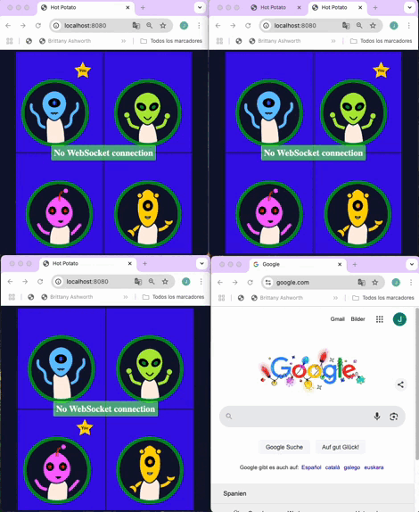

 # WebSockets Hot Potato 🥔🔥

**A WebSockets application demo.**  

Project realized in the Codecademy course *"Learn WebSockets"*.



---

## 🎮 **Game Rules**

* Upon connecting to the server, choose a name. This name will be displayed to other players at the start of the game. Your own player will show the text "You".
* Once the 4th player has joined the game, the game will start and the clock will begin counting down from 30.
* When the game starts, one player will be chosen randomly to hold the potato.
* If you are holding the potato, click on another player to pass the potato.
* If you are holding the potato when the time is up, you will lose!
* Only 4 players may join a game.

---

##  🚀 **Installation & Setup**

    1. Clone the repository:

    ```bash
    git clone https://github.com/delafuentej/webSockets_hotPotato.git
    ```
    2. Install the dependencies:
    ```bash
    npm install
    ```
    3. Run the development server:
    ```bash
    npm run dev
    ```
    ---
##  ✅ Requirements

    - Node.js (latest LTS version recommended)
    - npm (bundled with Node.js)

    ---
##  🪪 Contributing

Contributions are welcome! If you have suggestions for improvements or new features, feel free to open an issue or submit a pull request.


## 📹 **Application Demo**

If you want to see a visual demonstration of the project in action, check out the GIF above. If you encounter any issues while running the application, please refer to the **Contributing** section to report a problem or suggest improvements.